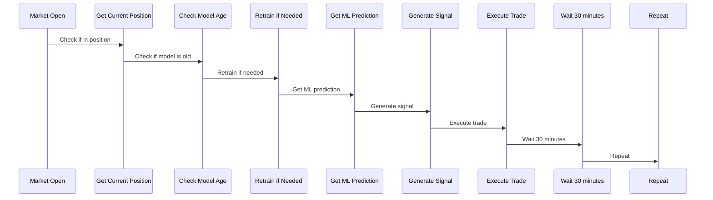

# Dead Zone Live Trading Strategy for OpenAlgo

## Overview

The Dead Zone Live Trading Strategy is a machine learning-based trading system that uses XGBoost to predict market movements and execute trades only when the model has high confidence. It implements a "dead zone" approach where trades are avoided when predictions fall within a certain uncertainty range.

## Features

- **Machine Learning Prediction**: Uses XGBoost classifier with comprehensive technical indicators
- **Dead Zone Logic**: Only trades when model confidence exceeds threshold (avoids uncertain market conditions)
- **CNC Product Type**: Designed for equity delivery trading using CNC (Cash and Carry)
- **MARKET Orders**: Uses market orders for quick execution
- **Auto Model Training**: Automatically trains and retrains the ML model
- **Real-time Data**: Uses WebSocket for live price updates
- **Position Management**: Tracks and manages positions automatically
- **NIFTY 50/BANKNIFTY Support**: Works with any NIFTY 50 or BANKNIFTY symbol

## Strategy Files

1. **`dead_zone_live.py`** - Basic implementation of the dead zone strategy
2. **`dead_zone_live_enhanced.py`** - Enhanced version with better error handling and configuration
3. **`nifty_symbols.py`** - Configuration file with NIFTY 50 and BANKNIFTY symbols
4. **`dead_zone.py`** - Original backtesting version (for reference)

## Quick Start

### 1. Basic Usage

```python
# Edit the SYMBOL variable in dead_zone_live.py
SYMBOL = "RELIANCE"  # Change to any NIFTY 50 stock

# Run the strategy
python dead_zone_live.py
```

### 2. Enhanced Version Usage

```python
# For enhanced version with better configuration
python dead_zone_live_enhanced.py
```

### 3. Available Symbols

Check `nifty_symbols.py` for the complete list:

```python
from nifty_symbols import NIFTY50_SYMBOLS, BANKNIFTY_SYMBOLS, print_available_symbols

# Print all available symbols
print_available_symbols()

# Popular symbols for different sectors
POPULAR_SYMBOLS = {
    "high_volume": ["RELIANCE", "TCS", "HDFCBANK", "INFY", "ICICIBANK"],
    "banking": ["HDFCBANK", "ICICIBANK", "KOTAKBANK", "AXISBANK", "SBIN"],
    "it_stocks": ["TCS", "INFY", "HCLTECH", "WIPRO", "TECHM"],
    "auto_stocks": ["MARUTI", "TATAMOTORS", "M&M", "BAJAJ-AUTO", "EICHERMOT"],
    "pharma_stocks": ["SUNPHARMA", "DRREDDY", "CIPLA", "DIVISLAB", "APOLLOHOSP"]
}
```

## Configuration

### Key Parameters

```python
# Dead Zone Strategy Configuration
DEAD_ZONE_LOWER = -0.0010  # -0.10% (lower threshold)
DEAD_ZONE_UPPER = 0.0010   # +0.10% (upper threshold)
SIGNAL_PROBABILITY_THRESHOLD = 0.60  # 60% confidence required for trades
DAYS_OF_HISTORY = 100  # Days of historical data for training
RETRAIN_FREQUENCY_DAYS = 7  # Retrain model every 7 days

# Trading Configuration
PRODUCT = "CNC"  # Cash and Carry for equity delivery
PRICE_TYPE = "MARKET"  # Market orders for quick execution
QUANTITY = 1  # Number of shares to trade
```

### OpenAlgo Configuration

```python
# Update your API key and host
client = api(
    api_key="your-openalgo-api-key",
    host="http://127.0.0.1:5000",
    ws_url="ws://127.0.0.1:8765"
)
```

## How It Works

### 1. Dead Zone Concept

The strategy defines a "dead zone" where the model avoids trading:

- **Uptrend Signal**: When next-day return prediction > +0.10% with 60%+ confidence → BUY
- **Downtrend Signal**: When next-day return prediction < -0.10% with 60%+ confidence → SELL  
- **Dead Zone**: When predictions fall between -0.10% to +0.10% or confidence < 60% → NO TRADE

### 2. Machine Learning Pipeline

1. **Data Collection**: Fetches historical daily data using OpenAlgo API
2. **Feature Engineering**: Creates 50+ technical indicators including:
   - Price-based features (OHLC ratios, ranges)
   - Moving averages (SMA, EMA) and crossovers
   - Momentum indicators (RSI, MACD, Stochastic)
   - Volatility measures (ATR, Bollinger Bands)
   - Volume indicators (OBV, volume ratios)
   - Time-based features (day of week, month)

3. **Model Training**: 
   - Uses XGBoost classifier
   - Handles class imbalance with scale_pos_weight
   - Feature selection to remove highly correlated features
   - Automatic retraining every 7 days

4. **Signal Generation**:
   - Generates probability for next-day uptrend
   - Converts probability to BUY/SELL/NO_TRADE signal
   - Only trades when confidence exceeds threshold

### 3. Position Management

- **Long Position**: When model predicts uptrend with high confidence
- **Short Position**: When model predicts downtrend with high confidence (via SELL)
- **Position Reversal**: Closes existing position before opening opposite position
- **Risk Management**: Tracks current positions and quantities

### 4. Execution Flow



## Requirements

### Python Dependencies

```bash
pip install pandas numpy scikit-learn xgboost pandas-ta quantmod openalgo
```

### System Requirements

- OpenAlgo platform running
- Valid broker account connected to OpenAlgo
- Python 3.8+ environment
- Sufficient historical data (recommended: 100+ days)

## Risk Management

### Built-in Risk Controls

1. **Signal Confidence**: Only trades when model confidence > 60%
2. **Dead Zone Protection**: Avoids trading in uncertain market conditions
3. **Position Tracking**: Monitors current positions to prevent over-exposure
4. **Market Hours**: Only operates during market hours (9:15 AM - 3:30 PM)
5. **Model Validation**: Validates features and handles data quality issues

### Recommended Additional Controls

1. **Position Sizing**: Adjust `QUANTITY` based on account size and risk tolerance
2. **Stop Loss**: Consider adding stop-loss orders for risk management
3. **Maximum Position**: Set maximum position limits
4. **Drawdown Limits**: Monitor and limit maximum drawdown
5. **Market Conditions**: Avoid trading during high volatility or news events

## Monitoring and Maintenance

### Log Monitoring

The strategy provides detailed logging:

- LTP updates from WebSocket
- Model training status and performance
- Signal generation with confidence levels
- Order placement and execution status
- Position updates and changes

### Model Maintenance

- **Automatic Retraining**: Model retrains every 7 days
- **Performance Monitoring**: Track model accuracy and prediction quality
- **Feature Importance**: Monitor which features drive predictions
- **Data Quality**: Validate historical data availability and quality

### Performance Tracking

Monitor these key metrics:

- **Signal Accuracy**: Percentage of correct directional predictions
- **Trade Frequency**: Number of trades per day/week
- **Win Rate**: Percentage of profitable trades
- **Risk-Adjusted Returns**: Sharpe ratio and other risk metrics
- **Drawdown**: Maximum and current drawdown levels

## Troubleshooting

### Common Issues

1. **Model Training Fails**
   - Check if sufficient historical data is available (100+ days)
   - Verify symbol is correct and data is accessible
   - Check for data quality issues (missing values, outliers)

2. **No Signals Generated**
   - Model may be in "dead zone" (uncertain predictions)
   - Check probability threshold settings
   - Verify model is loaded correctly

3. **Order Execution Fails**
   - Check OpenAlgo API key and connection
   - Verify broker account has sufficient funds
   - Check symbol format and exchange settings

4. **WebSocket Connection Issues**
   - Verify WebSocket URL is correct
   - Check network connectivity
   - Restart the strategy if connection drops

### Debug Steps

1. **Enable Detailed Logging**: Add more print statements for debugging
2. **Test with Paper Trading**: Use paper trading mode for testing
3. **Check Model Performance**: Evaluate model on historical data
4. **Validate Data Pipeline**: Ensure data fetching and processing work correctly

## Disclaimer

This strategy is for educational and research purposes only. Live trading involves significant financial risk, and past performance does not guarantee future results. Always:

- Test thoroughly with paper trading first
- Use appropriate position sizing and risk management
- Monitor the strategy continuously during live trading
- Have stop-loss and emergency procedures in place
- Understand the risks involved in algorithmic trading

## Support

For issues and questions:

1. Check OpenAlgo documentation: https://docs.openalgo.in
2. Review the strategy logs for error messages
3. Test individual components (data fetching, model training) separately
4. Ensure all dependencies are properly installed 